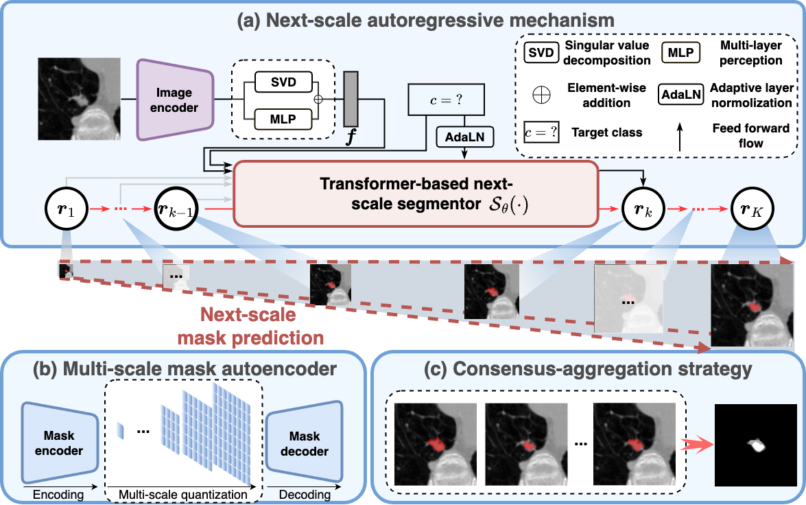

# AR-Seg: Autoregressive Medical Image Segmentation via Next-Scale Mask Prediction
This is the official implementation of the paper "Autoregressive Medical Image Segmentation via Next-Scale Mask Prediction" at the 28th International Conference on Medical Image Computing and Computer-Assisted Intervention (MICCAI 2025). 

## Updates
Oct 2025: initial commit.  

## Approach


## Data Preparation
The LIDC-IDRI dataset can be downloaded from [data link](https://pantheon.corp.google.com/storage/browser/hpunet-data/lidc_crops). It is preprocessed and given by [Probabilistic UNet](https://github.com/SimonKohl/probabilistic_unet)

#### Dataset structure:
```
LIDC/
  |--train/
      |--images/
        |--LIDC-IDRI-0001/
          |--z-105.0_c0.png
          |--z-107.0_c0.png
          ...
        |--LIDC-IDRI-0001/
        ...
      |--gt/
        |--LIDC-IDRI-0001/
          |--z-105.0_c0_l0.png
          |--z-105.0_c0_l1.png
          |--z-105.0_c0_l2.png
          |--z-105.0_c0_l3.png
          |--z-107.0_c0_l0.png
          |--z-107.0_c0_l1.png
          |--z-107.0_c0_l2.png
          |--z-107.0_c0_l3.png
          ...
        |--LIDC-IDRI-0001/
        ...
  |--val/
  |--test/
```

## Citation
If you find our work and code helpful, please kindly cite the corresponding paper:
```
@article{chen2023ascon,
  title={Autoregressive Medical Image Segmentation via Next-Scale Mask Prediction},
  author={Chen, Tao and Wang, Chenhui and Shan, Hongming},
  journal={MCCAI 2025},
  year={2025}
}
```
